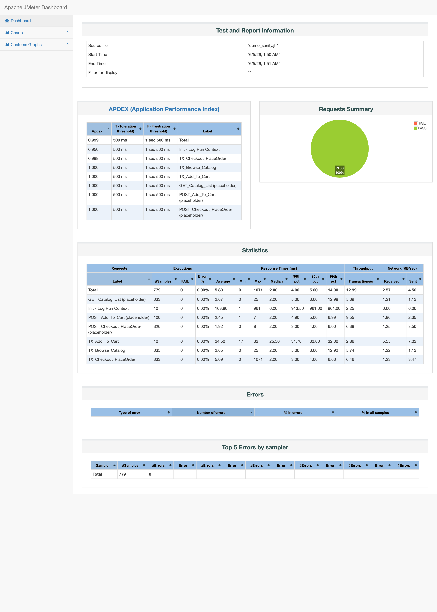

# ShopLite — Performance Testing Skeleton (Apache JMeter 5.5)

This package provides a maintainable **starter skeleton** for performance testing ShopLite using **Apache JMeter 5.5**.

It is intentionally **endpoint/payload-agnostic** (placeholders), because no Swagger/Postman examples were provided. Once an API contract is available, we could replace paths, payloads, and correlation rules without changing the overall structure.

## Contents
- `jmeter/test-plans/ShopLite_Scenarios.jmx` — main test plan (ready to run; uses placeholder endpoints)
- `jmeter/test-plans/ShopLite_Base.jmx` — base components template (for reuse/copy)
- `jmeter/config/env.properties` — environment settings (protocol/host/port/basePath)
- `jmeter/config/load_sanity.properties` — load profile for sanity runs (no CLI overrides needed)
- `jmeter/config/load_baseline.properties` — load profile for baseline runs (no CLI overrides needed)
- `jmeter/config/load_targeted.properties` — generic targeted profile (no CLI overrides needed)
- `jmeter/config/load_cart1.properties` — targeted cart-size experiment (1 item)
- `jmeter/config/load_cart10.properties` — targeted cart-size experiment (10 items)
- `jmeter/config/load_cart50.properties` — targeted cart-size experiment (50 items)
- `jmeter/config/load.properties` — generic load profile (optional; for ad-hoc overrides)
- `jmeter/data/products.csv` — sample product IDs
- `jmeter/data/guest_profiles.csv` — optional guest checkout profiles
- `jmeter/scripts/groovy/guest_data.groovy` — unique guest data generator (JSR223 PreProcessor)
- `docs/Proposed_Test_Approach.md` — proposed performance testing approach (strategy, SLIs/SLOs, cadence)
- `docs/Project_Brief.md` — anonymized project brief / context this approach responds to

## Repository Structure
jmeter/
  test-plans/
    ShopLite_Base.jmx
    ShopLite_Scenarios.jmx
  config/
    env.properties
    load.properties
  data/
    products.csv
    guest_profiles.csv
  scripts/
    groovy/
      guest_data.groovy
docs/
  Proposed_Test_Approach.md
README.md

## Prerequisites
- Apache JMeter **5.5**
- Java compatible with your JMeter distribution
- **Random CSV Data Set** plugin (BlazeMeter) — install via JMeter Plugins Manager; the test plan uses `RandomCSVDataSetConfig` for product/guest data

> **Note on paths:** the test plan references data and script files using paths **relative to the repository root** (e.g. `jmeter/data/products.csv`). Run the `jmeter` CLI from the repo root so these resolve correctly.

> **Note on results:** `jmeter/results/` is git-ignored. Generated `.jtl` files and HTML reports are produced locally when you run the tests (see commands below).

## Configuration
### 1) Environment
Edit `jmeter/config/env.properties`:
- `protocol` (e.g., `https`)
- `host` (e.g., `test.shoplite.local`)
- `port` (e.g., `443` or `80`)
- `basePath` (optional, e.g., empty or `/api` prefix if needed)

### 2) Load profiles
Use one of the provided profiles:
- Sanity: `jmeter/config/load_sanity.properties`
- Baseline: `jmeter/config/load_baseline.properties`
- Targeted: `jmeter/config/load_targeted.properties`
- Cart-size experiments: `jmeter/config/load_cart1.properties`, `load_cart10.properties`, `load_cart50.properties`

Key parameters:
- `threads`, `rampUpSec`, `durationSec`
- `runType` (`sanity` / `baseline` / `targeted`)
- `cartSize` (1 / 10 / 50)
- `thinkTimeMinMs` and `thinkTimeRangeMs` (Uniform Random Timer)

## Running (CLI)
From the repository root. Ensure the output directories exist:

```bash
mkdir -p results
```

### Sanity run
```bash
jmeter -n \
  -t jmeter/test-plans/ShopLite_Scenarios.jmx \
  -q jmeter/config/env.properties \
  -q jmeter/config/load_sanity.properties \
  -l jmeter/results/sanity.jtl \
  -e -o jmeter/results/report_sanity
```

### Baseline run
```bash
jmeter -n \
  -t jmeter/test-plans/ShopLite_Scenarios.jmx \
  -q jmeter/config/env.properties \
  -q jmeter/config/load_baseline.properties \
  -l jmeter/results/baseline.jtl \
  -e -o jmeter/results/report_baseline
```

### Targeted run (generic)
```bash
jmeter -n \
  -t jmeter/test-plans/ShopLite_Scenarios.jmx \
  -q jmeter/config/env.properties \
  -q jmeter/config/load_targeted.properties \
  -l jmeter/results/targeted.jtl \
  -e -o jmeter/results/report_targeted
```

### Cart-size experiments (no CLI overrides)
**Cart size = 1**
```bash
jmeter -n \
  -t jmeter/test-plans/ShopLite_Scenarios.jmx \
  -q jmeter/config/env.properties \
  -q jmeter/config/load_cart1.properties \
  -l jmeter/results/cart1.jtl \
  -e -o jmeter/results/report_cart1
```

**Cart size = 10**
```bash
jmeter -n \
  -t jmeter/test-plans/ShopLite_Scenarios.jmx \
  -q jmeter/config/env.properties \
  -q jmeter/config/load_cart10.properties \
  -l jmeter/results/cart10.jtl \
  -e -o jmeter/results/report_cart10
```

**Cart size = 50**
```bash
jmeter -n \
  -t jmeter/test-plans/ShopLite_Scenarios.jmx \
  -q jmeter/config/env.properties \
  -q jmeter/config/load_cart50.properties \
  -l jmeter/results/cart50.jtl \
  -e -o jmeter/results/report_cart50
```

### Optional: ad-hoc overrides
If you still need quick overrides, you can pass `-J` properties, e.g. `-Jthreads=10 -JdurationSec=1200 -JcartSize=50`.

## Placeholder endpoints / payloads
The test plan uses placeholder paths:
- Browse: `GET /api/catalog`
- Add-to-cart: `POST /api/cart/items`
- Checkout: `POST /api/orders`

Replace them with real paths once Swagger/Postman is available. Correlation placeholders exist for `cartId` and `orderId`.

## Demo run against a local mock backend
Because the endpoints are placeholders, the repo ships a tiny dependency-free mock
backend so you can produce a realistic (green) run and see the reporting artifacts
without a real environment.

> The mock is a **demonstration aid only**. The latencies it produces are not
> representative of any real system — they only show what the reporting output looks like.

```bash
# 1) start the mock (separate terminal), serves the 3 placeholder endpoints
python3 mock/mock_server.py 8080

# 2) run the sanity profile against it, from the repo root
jmeter -n \
  -t jmeter/test-plans/ShopLite_Scenarios.jmx \
  -q jmeter/config/load_sanity.properties \
  -Jprotocol=http -Jhost=localhost -Jport=8080 \
  -l jmeter/results/demo_sanity.jtl \
  -e -o jmeter/results/report_demo_sanity

# 3) open jmeter/results/report_demo_sanity/index.html
```

Example dashboard from such a run (10 threads, 60s, cart size 10):



| Transaction | Samples | Error % | Avg (ms) | p95 (ms) | p99 (ms) | TPS |
|---|---:|---:|---:|---:|---:|---:|
| TX_Browse_Catalog | 335 | 0.00% | 3 | 5 | 13 | 5.7 |
| TX_Add_To_Cart | 10 | 0.00% | 24 | 32 | 32 | 2.9 |
| TX_Checkout_PlaceOrder | 333 | 0.00% | 5 | 3 | 7 | 6.5 |
| **Total** | **779** | **0.00%** | 6 | 4 | 14 | 13.0 |

## Notes
- The plan is designed for **API-level** measurement. UI is used only to define journeys, not to measure UI performance.
- Keep listeners disabled in non-GUI runs; use HTML report generation (`-e -o`).
- The `TX_Add_To_Cart` transaction wraps a loop of `cartSize` add-item requests (each with its own think time), so it issues `cartSize`× more HTTP samples and takes several seconds to complete. Under a fixed-duration run, many of its instances are still in flight when the scheduler stops the threads and are therefore not recorded — which is why its completed-transaction count is much lower than the single-request browse/checkout transactions. Use a loop-count (iteration-based) run if you need an equal number of completed transactions per journey step.
